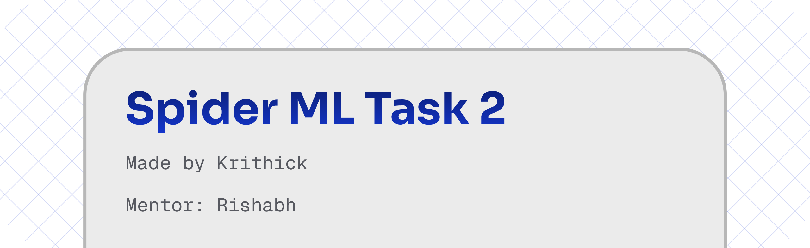
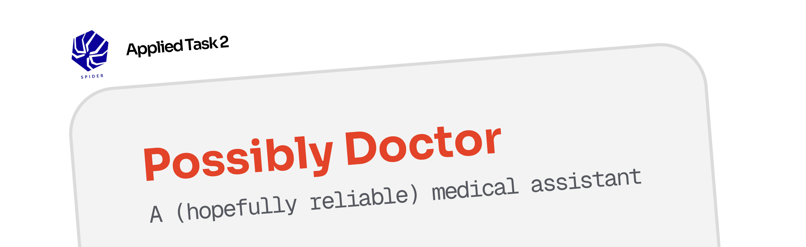

The folders are named as per their tasks

**The applied ml vector db is available for download from the releases section as `vectorstore.7z`, so evaluators need not embed again**

**API key for Voyage AI Embeddings API can also be provided if needed for evaluation**

### Also Contains:

_Built by Krithick, guided by mentor Rishabh_