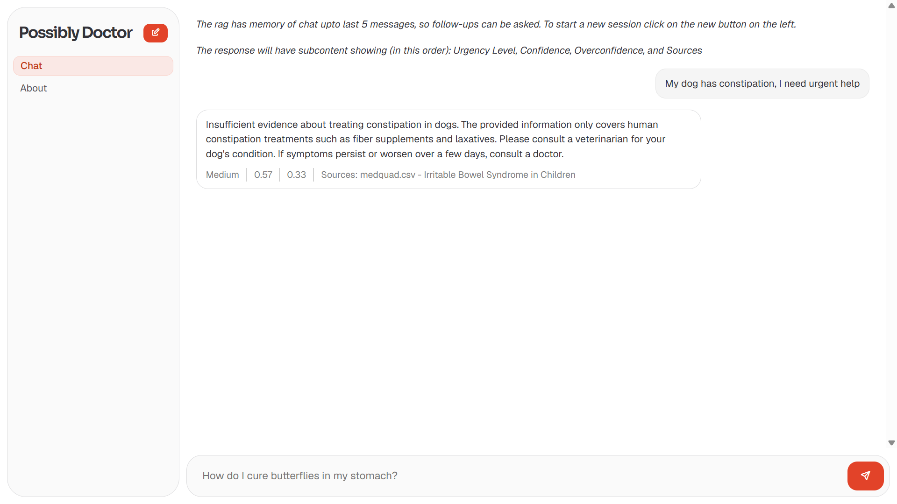

The folders are named as per their tasks

For the base tasks:
- An `intro.md` describes my transition from task 1 to 2
- A `journal.md` has been attached in each of the folders showing my learning process/approach
- `observations.md` include my observations
- `readme.md` includes some basic results

**The applied ml vector db is available for download from the releases section as `vectorstore.7z`, so evaluators need not embed again**

**API key for Voyage AI Embeddings API can also be provided if needed for evaluation**

### Also Contains:

(Present in the applied folder, full description available in readme)

_Built by Krithick, guided by mentor Rishabh_