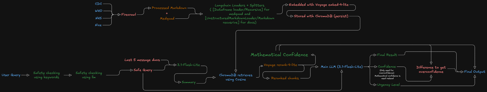
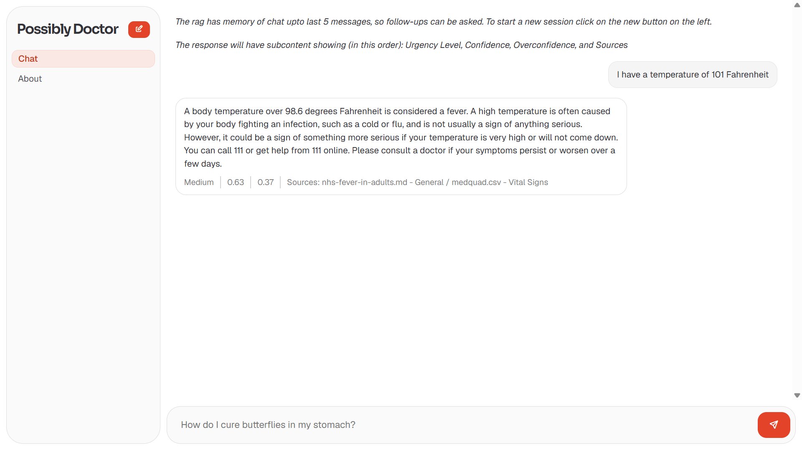

`(banner made in figma coz I was curious about it)`

- This is my submission for the applied ml task - 2 of spider-ml inductions.

- The `architecture` folder contains the Architecure design chart, and a markdown file, containing my architectural choices

- The `outputs` folder contains sample input/outputs and proofs for the same.

- The `evaluation-suggestions.md` contains suggested methods for evaluation.

- *This* file contains my documentation of how I built it.

- The `code` folder contains my code

- The vector db can be downloaded from the releases section, `vectorstore.7z` and is to be extracted into the code directory as `vectorstore`.

Libraries I used for this:
 - Langchain for rag purposes
 - Chromadb as vector db
 - Pydantic to structure LLM outputs
 - Voyage AI Embeddings
 - Google Gemini API
 - Firecrawl for scraping and processing
 - FastAPI for api
 - Tabler Icons for the ui icons
 - Sora, Geist fonts for ui

*Vectorestore database should be zipped in the releases section, should be extracted before using*

My Process (Over the span of 4.5 weeks):
`I might not have followed the ideal roadmap for building a rag pipeline, but I focused my efforts into improving upon what I did last time`

- First, I'm not sure why but I always like looking at the data I'm dealing with. I opened medquad, a couple who guidelines and I immediately knew that I couldn't do random simple ingestions.
- I spent quite a bit of time trying different ways of ingestion like pypdfreader, pymupdf4llm, etc. But they all didn't do what I wanted. All I wanted was the juicy text part. I didn't want the covers, index, bibliography, citations etc. Docling proved to be a nice fit for this, but the issue was using it made my laptop do nuclear fission. That or I must've been using it wrong.
- Finally I decided on firecrawl. (I was watching a youtube video when it came as a sponsored ad... the video was by t3.gg). I got a free api key and parsed all my sources into markdown. Then I ingested medquad using dataframe loader and markdown files using recursive splitter with the language set to markdown.
- The hardest part was embedding. Medquad was hugeee, and I had a lot of files. I tried using local embeddings, and I tried HARD.
- I used baai, qwen3, nomic embed, all-minilm, cohere, google embeddings even fastembed by qdrant. They all either took super super long to embed or rate-limited me, so much so that not even one finished embedding.
- Then after a bit of research I came across voyageai, which has a SICK free tier, and I got my free api key with my dad's card (I made sure it didn't charge) and got to embedding.
- **BUT** then I didn't like the way I had designed my code. It was really messy. So like a good person, I scrapped everything and started from scratch. I defined my entire rag model in a single class, and designed it in such a way that I could define one instance and use it for all the parts of rag.
- When it came to retrieval, I initially just prompted the llm to use the context, give me response along with confidence score. *That was dumb*.
- LLMs aren't that good with math. I noticed that my poor prompting along with the LLM's inability to add created a duo which cannot be rivalled. I fixed this by using pydantic. Pydantic is so cool, I can't believe I hadn't heard about it before. I used it to define confidence score (foreshadowing), citations, urgency levels and safety flags.
- I thought everything was cool... until some things happened. See, the llm I chose at that time was a local model (phi3 by microsoft) and apart from being slow (on my laptop), it's citations were very bad, urgency levels weird and it didn't adhere to the pydantic format.
- I should've just upgraded the llm, but instead, I did the right thing. I moved everything out of the pydantic response type except urgency level and response. I defined citations with the chunk metadata, the confidence using the scores given by the reranker. and scrapped safety-flags coz I was a daredevil.
`(At this point I moved to building ui, but came back to upgrade the rag A LOT)`
- That worked for a bit and after testing on the terminal I moved to building ui. I used html, css and javascript like last time, but this time, I had one goal. To make my website look like a fancy big-company chatbot. I knew a bit of javascript so that part was fine, but the css knocked me out. It seemed like the website just wouldn't listen to me. 
- I rage-quit the ui for a bit and decided to upgrade my rag. Firstly I made the code more modular, moving all the config data to a seperate file, response types in a seperate file, prompt templates in a seperate file, and the datasources to be injested in json.
- I then wanted to make my pipeline as performative as possible. I switched to `gemini-3.1-lite`, re-ingested after cleaning up some sources, re-embedded, and decided that I wanted to add:
    - Memory (*sigh*)
    - Safety Flagging
    - Overconfidence: This is something I thought of while building. I thought, if the llm thinks it's confidence is one thing, and the top reranker score is another, then the difference between the two should give the overconfidence of the llm, like a measure of it's hallucinations and groundedness.
- I tried so many things to implement memory, conversation-summary-memory, vectorstore-retriever-memory, but some were deprecated and I didn't like the way some worked. But what worked for me was the `InMemoryChatMessageHistory`. Since I was aiming for a demo, I thought this was fine, but in the future I wanna store the memory to a database.
- Anyways, I stored the last 5 message-pairs, passed them into a summarizer llm (for this, it's the model as main llm) along with the user query and told it to generate summary with question. That worked. I passed that result into my actual llm and boom, I had memory.
- It was at this point I realized that just implementing was NOT enough. I spend a week fine tuning everything, and it's still not the way I wanted it :(.
- For safety flagging I put every bad/dangerous word I could think of into a python list, and flagged using that. But I decided that wasn't enough and added ANOTHER danger-checker llm to cross check the query (outputs bool using pydantic). I then passed the verified prompt into the llm.
- Making sure the llm dealt with dangerous symptoms and gave safe advice was hard. I would've tried at least 10 different prompts.
- Then I went back to the ui with a new found error, referred google, stackoverflow for every doubt and finally got the ui the way I wanted it.
- I built the fastapi server, hooked everything up and boom, IT DIDN'T WORK. Turns out I made a silly mistake when parsing the memory, fixed it and boom, _now_ it worked.

I hope that the spider seniors do like it, I've tried very hard to improve upon from last time in features like:
- Reranking
- Ingestion
- Memory
- UI design
- Data Processing
- Code Design

Thanks to the spider seniors for the opportunity to work on something so cool.

Huge thanks to my mentor Rishabh for helping and clearning all my doubts throughout my process. I hope to build more projects like this in the future.