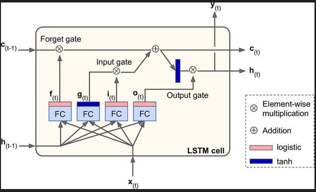

# My Complete Process to building the LSTM.

Prior to building I wanted to learn as much as possible, so under the guidance of my mentor Rishabh, I built GRUs, RNNs and other LSTMs too.

- The main book I referred was _`Hands on Machine Learning with SciKit Learn and Pytorch`_ - O'reilly Pub.

- I first started by looking at the lstm diagram. It looked something like this:

- 

- When I first saw it I didn't understand it, so I began watching youtube videos, this one video by a channel called `statquest` helped a little. But when I still didn't get it fully, I took out pen and paper and began following the lines in the flowchart and writing equations. Ig there's something special about writing coz that helped me understand everything. At least, I realized that the mind map was a way of representing these equations.

- But one thing I still didn't get was why tanh and sigmoid were used in their specific positions and why the structure mattered. I googled a bit and saw some responses on forums and finally got it, how sigmoid was used to squash between 0 and 1 and helps the system decide what and how much of it to add or forget. But tanh is used for the cell state as it ranges between -1 and 1 which also helps in removing certain content.

- I then got to building. Actually prior to this, I had some experience in RNNs thanks to my mentor (Rishabh), the stuff I built should be in the main readme file.

- First, in order to decide what hyperparameters/arch would work best, I used the default `nn.LSTM`. Once I found my best features, I implemented them.

- My current code must be maybe the 6th iteration. First I used linear layers, then a single layer with chunking, then raw `nn.Parameter`s in order to customize weight initialization.

- For data parsing, I tried many things, but first I researched how meteorologist actually do the feature engineering. Cyclic representation of time and velocities seemed to be the most important so I implemented them. I tried removing certain features which didn't have much correlation (I used the pandas in-built function to find correlation with the temperature 12 steps ahead), but I found that it worked best with all features.

## Things I improved from last time:

- **I tried following good coding principles**: I defined the epoch and evaluation data in a function that I called, I parsed the data in such a way that properties that needed to be applied after resampling were only done after to save memory.

- **I went about the problem after learning thoroughly**: I made sure that I didn't just randomly start building but learnt and built smaller projects so that I'd have a good understanding.

- **Proper data parsing**: I properly went through the data, and plotted different columns to check and fixed some random issues I found.

- **Documented my results with different parameters**: I changed the architecture and hyperparameters and noted down my results with each so that I may compare properly. Last time I went with memory.

## Things I want to improve:

- I'm not sure what this is, but every time I was working, I had the sudden and unexplainable urge to just scrap everything and start fro scratch. Idk why but I really need to fix it and have more patience in what I'm doing.

- I also wanna go deeper into the concepts. Everytime I look at stuff like lstm or transformers or even rag design principles, my mind immediately goes 'How did they ever come up with that'. I really wanna understand the thought process behind coming up with revolutionary ideas.

_A huge thanks to my spider seniors and my mentor, Rishabh_

