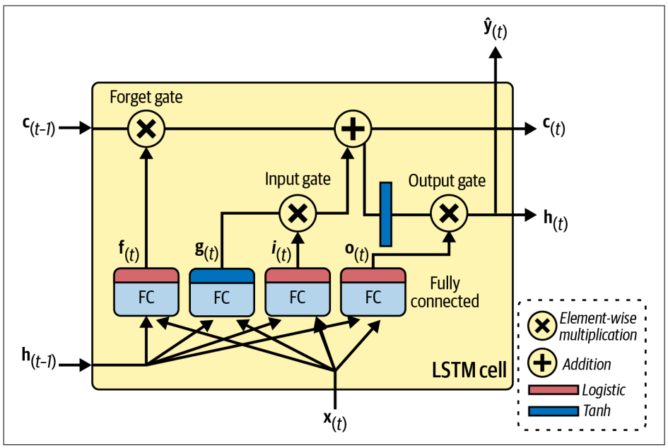

### _My journal through how I built the lstm from studying to completion is also attached in `journal.md`. It contains **what I improved from last time and what I learnt as well**_.

# My Observations and Understanding of LSTMS

_I've attached my notes that I used to study LSTMs as well_.

^^This is the diagram I followed^^

## Role of the gates

- At first when I finally got the equations for the LSTM I didn't get why the gates were the way they were designed, it was only while building that I finally understood.

To my understanding,

- The hidden state represents the short-term state, same as in rnn, but in lstm, we have an additional cell state which stores the long-term memory.

- The forget gate decides what data should be forgotten. It's passed through sigmoid as it acts like a multiplier, converting the data from 0 to 1, 0 means that it's better to forget and 1 means that it should be kept.

- The most important layer is g, as it analyzes both the inputs and the previous states, since it's not being added directly, nor is it being multiplied, tanh activation is used as we're sorta converting useless data to more negative values and converting it into a raw scale of importance, so the model can choose to add or remove from the cell state.

- The input gate decides which part of that g layer should be added. It converts the two inputs into a range from 0 to 1 (sigmoid), then when it's multiplied with the g layer (passed through tanh), a range from -1 to 1 on a scale of importance is obtained.

- Basically the forget gate multiplies the cell state with respect to information from the previous hidden and current inputs such that unnecessary data is forgotten. The main layer g, processes the new inputs and is multiplied by the input gate to retain important info and scrap bad ones. This new info is then added to the cell state, and returned.

- Finally the output gate returns the part of the long term memory and the inputs that should be updated in the next hidden state.

- Sequence lengths were some of the most influential parts on my lstm. I learnt that both the input and output sequence length heavily influenced the lstm. The smaller the output sequence, the better the lstm performs, for instance, forecasting just one hour was a lot more accurate than 12.

- I also think that having more input sequences allows the lstm to make a more educated prediction, so in that way 72 input hours and 12 output hours were kinda challenging.

- The training stability was something I noticed very clearly coz of all the overfitting it did. After a point the lstm loss did not decrease at all. I looked it up and found that coz of tanh and sigmoid, if backprop gets stuck in a flat region with slope 0, the model will stop learning. I also had to apply dropout between the lstm layers and in the output to hopefully stop overfitting.

- I learnt that I should split the data chronologically, for the model to (not cheat) and not have future information. I prevented data leakage by fitting the scaler (I just did it mathematically) on only the training data.

### Challenges:

- One of the main challenges was the data. Weather has an element of jaggedness and slight chaos to it. With a 12-step prediction, sometimes it wasn't smooth. I couldn't expect the model to exactly fit on the 12 steps, when each output sequence was so different, unsmooth, and jagged. The model usually predicts smooth curves following the path of the actual weather to some extent, but of course, couldn't keep up with the randomness. If it _did_ follow the training weather data really close, despite all the random spikes and lows and not being smooth, I'd classify that as overfitting.

- The model did overfit a bit, and I first tuned the hyperparameters so as to not bloat it with a bunch of memory and power that might make it do so. I also implemented early stopping.

- I think the lstm was the part of the task I faced most challenges with. The first thing was data processing. As aforementioned, I had to fix a lot of the columns, drop na, and the wind velocity had crazy sensor errors as well.

- Apart from that I would've ran maybe 10 iterations again, and again changing the schedulers, gradient clippers, hidden size, number of layers, the features I would drop. It seemed as though everything was a variable that I had to modify and tune to get the best results. But eventually I calmed down, and tried one-by-one (with the nn.LSTM for speed), I saw parameters helped, and which didn't.

- I actually worked on the lstm and transformers side-by-side continuously from finishing the resnet till I finished the healthcare chatbot.

- Coming to the actual forecasting challenges, 72 hours i.e 72 pieces of input timeseries data was slightly contrictive. I tested forecasting the next hour, which was very accurate, but predicting the next 12 had significant accuracy drops, and seeing the predictions vs. real graphs was heartbreaking.

- Also sometimes when I was using MSE Loss, the model was too flat, coz mse penalizes outliers really heavily. This was fixed by using huber loss instead.