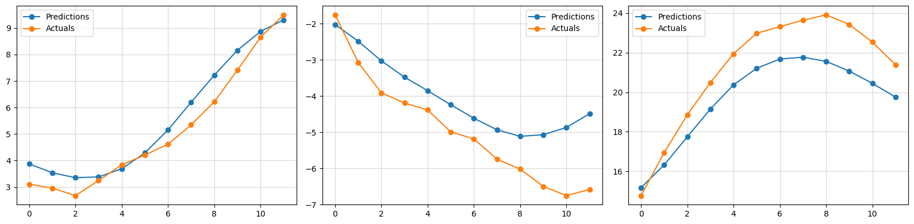

# BASE ML Task 2: LSTM Implementation

- The `journal.md` contains some info on how I approached this.
- The `observations.md` contains my observations.

- Final Testing Loss (Not Normalized): 
```
MSE:	0.037641070783138275
MAE:	0.14186249673366547
Huber:	0.018816577270627022
```

- Final Testing Loss (Celcius): 
```
MSE:	2.8131922782710572
MAE:	1.2264117073413199
Huber:	0.8296535402656755
```

