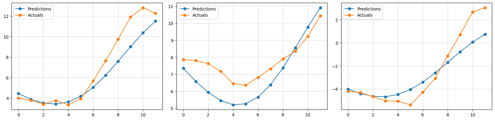
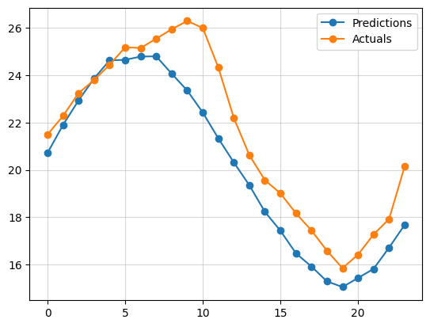
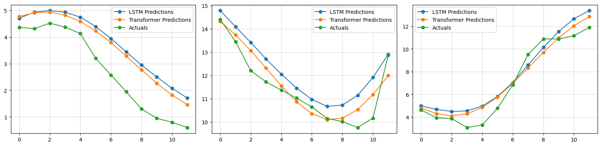

# BASE ML Task 1: Encoder-Only Transformer Implementation

- The `journal.md` contains some info on how I approached this.
- The `observations.md` contains my observations.

- Final Testing Loss: 720 (Not Normalized): 
```
MSE:	0.06960774958133698
MAE:	0.20256805419921875
Huber:	0.03479577228426933
```

- Final Testing Loss: 72 (Not Normalized): 
```
MSE:	0.03705659508705139
MAE:	0.14207923412322998
Huber:	0.018525492399930954
```

- Final Testing Loss 720 (Celcius): 
```
MSE:	2.7695103953631457
MAE:	1.2282855642812927
Huber:	0.8288445385244921
```

- Final Testing Loss 720 (Celcius): 
```
MSE:	5.202295712598031
MAE:	1.751215804599216
Huber:	1.3171523773027556
```
`Transformer 72`



`Transformer 720`



`Transformer vs. LSTM`

